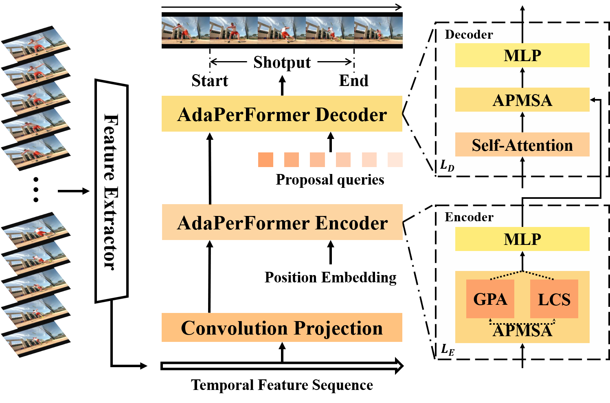

# AdaPerFormer: Adaptive Perception Transformer for Temporal Action Localization

## Introduction
This code repo implements AdaPerFormer, described in the technical report: [AdaPerFormer](http://arxiv.org/abs/2208.11908) 
The complete code will be made public after the accepted paper.


## Updates logs
[2022.8.25] Update the arxiv URL.
[2022.8.25] Update the project details. 

## Code Overview
The main components of this project are：
* ./configs: dataset config.
* ./datasets: Data loader and IO module.
* ./model: Our main model with all its building blocks.
* ./src: Startup script, including train and test.
* ./utils: Utility functions for training, inference and other utils.

## Requirements
- Linux
- Python >= 3.5
- CUDA >= 11.0
- GCC >= 4.9
- Other requirements:
```bash
    pip install -r requirement.txt
```
## Data Preparation
1. Download the original video data from [thuoms](https://www.crcv.ucf.edu/THUMOS14/download.html) and use the [I3D](https://github.com/piergiaj/pytorch-i3d) backbone to extract the features.
2. Place I3D_features into the folder `./data`

* The folder structure should look like follows:
```
This folder
│   README.md
│   ...  
│
└───data/
│    └───thumos14/
│    │	 └───i3d_features   
│    │	 └───annotations   
│    └───...
```